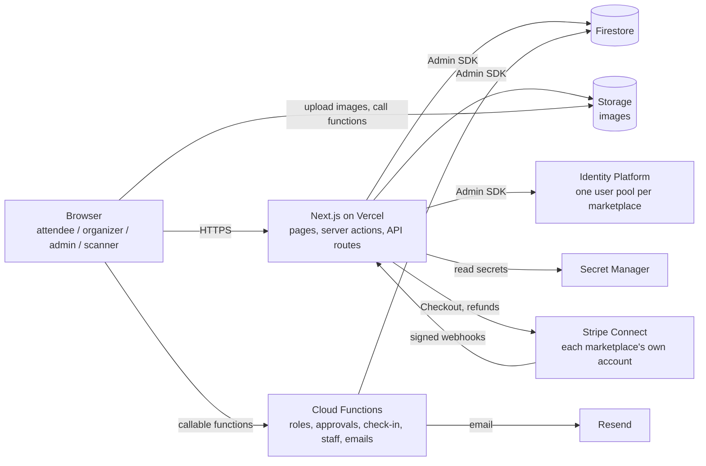
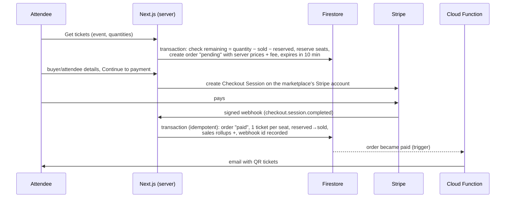

# TicketExpert — multi-tenant event ticketing SaaS

A platform for running **event-ticketing marketplaces** (concerts, sports, workshops, festivals), like a white-label
Eventbrite. One codebase serves many marketplaces ("tenants"), each on its own domain with its own branding,
users, organizers and payments.

```
Platform owner ──► Tenant (a marketplace, e.g. TicketExpert on ticketexpert.app)
                     ├── Tenant admin   approves organizers, sets branding, pages, commission, sees reports
                     ├── Organizers     create events and ticket types, see orders, refund, add door staff
                     ├── Attendees      buy tickets, get QR tickets by email, see "My tickets"
                     └── Scanner staff  check people in at the door with a phone camera
```

**Stack:** Next.js 16 (App Router, TypeScript) · Tailwind CSS · Firebase (Identity Platform auth, Firestore, Storage,
Cloud Functions, App Check, Secret Manager) · Stripe Connect · Resend (email) · deployed on Vercel.

---

## Contents

1. [Run it locally in 5 minutes](#1-run-it-locally-in-5-minutes)
2. [Use it: a walkthrough for every role](#2-use-it-a-walkthrough-for-every-role)
3. [How the system works](#3-how-the-system-works)
4. [Connect real services (Firebase, Stripe, email, Vercel, domains)](#4-connect-real-services)
5. [Project structure](#5-project-structure)
6. [Commands and tests](#6-commands-and-tests)
7. [Security in one page](#7-security-in-one-page)
8. [Troubleshooting](#8-troubleshooting)
9. [More documentation](#9-more-documentation)

---

## 1. Run it locally in 5 minutes

Everything runs on your machine against the **Firebase Emulator Suite** — no cloud account, no real money, no
real emails. The emulator project is `demo-ticketing`, which can never reach a real Firebase project.

### Requirements

| Tool | Why | Check |
|---|---|---|
| Node.js 22 | Next.js and scripts | `node -v` |
| Java 21+ | Firebase emulators | `java -version` (macOS: `brew install openjdk@21`) |
| Chromium for Playwright | end-to-end tests only | `npx playwright install chromium` |

### Steps

```bash
# 1. Install
npm install
npm --prefix functions install

# 2. Local settings and secrets (random values, local only; macOS sed syntax)
cp .env.example .env.local
QR=$(openssl rand -hex 32); WH=$(openssl rand -hex 32)
sed -i '' "s/^QR_SIGNING_SECRET=.*/QR_SIGNING_SECRET=$QR/; s/^TEST_PAYMENT_WEBHOOK_SECRET=.*/TEST_PAYMENT_WEBHOOK_SECRET=$WH/" .env.local
printf 'QR_SIGNING_SECRET=%s\nRESEND_API_KEY=dev\n' "$QR" > functions/.secret.local

# 3. Start everything (emulators + demo data + website)
npm run dev:all
```

Open **http://localhost:3000**. `dev:all` builds the Cloud Functions, starts the emulators (Auth 9099, Firestore
8080, Functions 5001, Storage 9199, **Emulator UI 4000**), seeds demo data on the first run and starts Next.js.
`Ctrl+C` stops everything and keeps the emulator data in `.emulator-data/`. Re-seed any time with `npm run seed`
(while the emulators run).

### Demo marketplaces and accounts

| URL | Marketplace |
|---|---|
| http://localhost:3000 (or `demo.localhost:3000`) | **TicketExpert** — logo, photos, 6 events, ~45 days of sales history |
| http://other.localhost:3000 | **Othertix** — a second marketplace, to see that data never crosses tenants |

| Account | Role | Start at |
|---|---|---|
| `admin@demo.test` | tenant admin | `/admin` |
| `organizer@demo.test` | organizer (Pulse Live) | `/dashboard` |
| `scanner@demo.test` | door staff | `/scanner/login` |
| `attendee@demo.test` | attendee (owns 3 tickets) | `/account/tickets` |
| `applicant@demo.test` | attendee with a pending organizer application | `/become-an-organizer` |
| `admin@other.test`, `attendee@other.test` | the second marketplace | — |

All demo accounts share the test password in [`scripts/seed-credentials.ts`](scripts/seed-credentials.ts). The login
page also shows **one-click demo buttons** (only when running against the emulators; never in production).

Emails are not sent locally: open the Emulator UI → Firestore → `devEmails` to read them. Payments use a **local test
provider** with "Pay (test)" / "Simulate a declined payment" buttons.

---

## 2. Use it: a walkthrough for every role

### Attendee (buying tickets)

1. Browse **Home** or **Browse events** (`/events`): search, filter by category, date, city, free/paid.
2. Open an event, pick ticket quantities, **Get tickets** → you must be logged in.
3. The seats are **held for 10 minutes**. Fill in buyer and (optional) per-attendee names and emails.
4. **Continue to payment** → Stripe Checkout in production; the local test page in development.
5. After payment: the confirmation page, an email with **QR tickets**, and the tickets under **My tickets**
   (`/account/tickets`) with a **PDF** download. Orders are under `/account/orders`.

### Organizer (selling tickets)

1. Sign up and open **Become an organizer** (`/become-an-organizer`): fill in the profile and apply.
2. Wait for the **tenant admin's approval** (email). After approval, log in again → **Dashboard** (`/dashboard`).
3. **Create event**: title, category, photos, venue or online, dates, refund policy, and **ticket types**
   (price, quantity, sales window). The checklist shows what is missing; **Publish** when ready.
4. **Orders**: every order; full **refunds** (money, seats and tickets are handled automatically).
5. **Attendees**: per-event list, check-in status, search, **CSV export**.
6. **Check-in staff**: add door staff by email and choose their events → they get an invitation email.
7. **Dashboard**: tickets sold, revenue (vs the previous period), a 7 / 30 / 90-day sales chart, upcoming events.
8. **Settings**: public profile (name, logo, bio) shown at `/o/<your-slug>`.

### Door staff (scanner)

1. Open the invitation email → set a password → go to **`/scanner/login`** on a phone.
2. Choose the event → point the camera at the ticket QR code (or **Enter ticket ID**).
3. Full-screen result: **Valid** (green), **Already used** (amber, with the first scan time and who scanned),
   **Invalid** (red, with the reason). A live counter shows checked-in / tickets issued.
4. Organizers can scan their own events with their organizer login too.

> The camera works only on `localhost` or HTTPS. To test on a real phone, deploy, or use an HTTPS tunnel.

### Tenant admin (running the marketplace)

| Page | What you do |
|---|---|
| **Overview** `/admin` | last 30 days of sales, commission, tickets; pending organizers |
| **Organizers** | approve, reject or suspend organizers (suspending unpublishes their events) |
| **Categories** | add, rename, reorder, hide categories |
| **Sales reports** | totals vs previous period, daily chart, by organizer, top events; CSV exports; custom date range |
| **Pages** | the **section editor**: show/hide, reorder and edit the text and photos of Home, About and Become an organizer → **Save draft**, **Preview** (only admins see drafts), **Publish** |
| **Settings** | marketplace name, logo, brand colours (with a readability check), support email, footer text, social links, commission %, and **Payments → Connect Stripe** |

---

## 3. How the system works

### 3.1 Big picture



- **The browser never writes business data.** Prices, orders, tickets, roles, sales numbers and pages are written
  only by server code (Next.js server actions / API routes with the Admin SDK) or Cloud Functions.
  Firestore and Storage security rules deny everything else.
- **Pages are server-rendered** with the tenant's data and branding; most screens need no client-side Firestore.

### 3.2 One codebase, many marketplaces (tenancy)

Every request goes through [`proxy.ts`](proxy.ts) (Next.js 16's middleware):

1. Reads the **hostname** (e.g. `ticketexpert.app`) → looks up `tenantDomains/{hostname}` → `tenantId`.
2. Unknown or inactive → "Marketplace not found" (404).
3. Passes the tenant id to the app in a request header and sets a fresh **CSP nonce**.

All tenant data lives under `tenants/{tenantId}/…` in Firestore. Each marketplace also has its **own Identity
Platform user pool**, so `admin@x.com` on one marketplace is a different account from the same email on another,
and a session cookie from marketplace A is rejected on marketplace B. Branding (name, logo, colours) is applied with
CSS variables from the tenant document.

### 3.3 Accounts, sessions and roles

- Sign-in happens in the browser with Firebase Auth (email/password or Google) in the marketplace's pool; the ID
  token is exchanged at `/api/auth/session` for an **httpOnly session cookie** (`__session`, 5 days).
- **Roles are custom claims** `{ role, tenantId, organizerId? }` and are set **only by Cloud Functions** (sign-up,
  organizer approval, staff creation, role changes) — never by the client.

| Role | Gets |
|---|---|
| `attendee` | default on sign-up: buy tickets, own tickets and orders |
| `organizer` | after admin approval: dashboard for their own events |
| `scanner` | created by an organizer: only `/scanner` for assigned events |
| `tenant_admin` | set by the platform owner: `/admin` for that marketplace |
| `platform_admin` | platform owner (works through server tooling) |

Every server page and action re-checks the session, the role and that the user belongs to this marketplace.

### 3.4 Buying a ticket (checkout → payment → tickets)



- **No overselling:** seat reservation is a Firestore transaction. Unpaid holds expire after 10 minutes (a scheduled
  function runs every minute) and the seats return.
- **Money** is stored as integers in cents. The **service fee** per paid ticket is `price × commissionRate`, paid by
  the buyer = the marketplace's commission. Payments go straight to the **marketplace's own Stripe account**
  (Stripe Connect, direct charges); the platform never sees card data.
- **Webhooks** are signature-checked and idempotent: a replayed webhook never creates tickets or counts sales twice.
- **Refunds** (organizer or admin): Stripe refund, then one transaction cancels the tickets, frees the seats, records
  the refund in the reports and writes the audit log.

### 3.5 QR tickets and check-in

- A QR code contains only `ticketId.tenantId.signature` (HMAC-SHA256 with a secret) — **no personal data**.
- Scanning calls the **`checkInTicket`** Cloud Function, which:
  1. checks the caller is an active scanner assigned to that event (or the organizer who owns it);
  2. verifies the signature and the marketplace;
  3. in a transaction, changes the ticket `valid → used` with time and scanner, bumps the live counter and writes
     the audit log.
- Two phones scanning the same ticket at the same moment: exactly one gets **Valid** (tested).

### 3.6 Reports

Each payment and refund also updates daily totals in the **same transaction**:
`salesDaily/{date}`, `organizerSalesDaily/{organizer}_{date}` and per-event totals in `eventStats/{event}`
(days in the marketplace's timezone). Dashboards and reports read these small documents instead of every order, so
they stay fast as sales grow. `npm run backfill:sales` rebuilds them from the orders if ever needed.

### 3.7 The page editor (Admin → Pages)

Home, About and Become an organizer are built from **sections** stored in `tenants/{t}/pages/{page}` as
`{ draft, published }`. The admin edits the draft; **Preview** shows it (to admins only); **Publish** makes it live.
Sections are fixed per page (the admin can toggle, reorder, edit text and photos, add stats and testimonials), all
text is shown as plain text (no HTML), and links can only be site paths or `https://`.

### 3.8 Data model (Firestore)

```
tenants/{tenantId}                    name, domains, branding, commissionRate, paymentConfig, authTenantId, …
  organizers/{organizerId}            name, slug, logo, bio, status (pending|approved|suspended), ownerUid
  events/{eventId}                    organizerId, title, slug, category, images, venue, startAt, endAt, status, …
    ticketTypes/{ticketTypeId}        name, price (cents), quantity, sold, reserved, sales window
  orders/{orderId}                    buyer, eventId, items, subtotal, fees, total, status, paymentRef, …
  tickets/{ticketId}                  orderId, eventId, attendee name/email, status (valid|used|cancelled), checkedInAt/By
  scannerAssignments/{uid}            eventIds, organizerId, name, active, scanCount, lastScanAt
  eventStats/{eventId}                checkedIn, ticketsIssued, sales totals
  salesDaily/{YYYY-MM-DD}             daily sales totals          organizerSalesDaily/{org}_{date}
  categories/{slug}  pages/{page}  auditLogs/{logId}
users/{uid}                           tenantId, displayName, email   (roles live in auth claims, not here)
tenantDomains/{hostname}              tenantId
```

Full detail: [docs/architecture.md](docs/architecture.md).

---

## 4. Connect real services

The step-by-step runbook is **[docs/deploy.md](docs/deploy.md)**. In short:

| Service | What to set up | Where it is used |
|---|---|---|
| **Firebase project** (Blaze) | Identity Platform + multi-tenancy, Firestore, Storage, web app config | everything |
| **Rules & indexes** | `firebase deploy --only firestore:rules,firestore:indexes,storage` | data security, queries |
| **Secret Manager** | `QR_SIGNING_SECRET`, `STRIPE_SECRET_KEY`, `STRIPE_WEBHOOK_SECRET`, `RESEND_API_KEY` | QR signing, payments, email |
| **Cloud Functions** | `firebase deploy --only functions`; register the `beforeCreate` blocking function | roles, approvals, check-in, emails |
| **Vercel** | import the repo; env vars from deploy.md §6; enable OIDC federation | the website |
| **Google ↔ Vercel** | a service account + Workload Identity Federation (no key files) | the website reaching Firebase |
| **App Check** | reCAPTCHA Enterprise key with all domains; then enforce | blocks scripted abuse |
| **Stripe Connect** | platform account + webhook `https://<platform>/api/webhooks/stripe` (connected accounts) | payments, refunds |
| **Resend** | verify the sending domain; `EMAIL_FROM` | ticket, approval and staff emails |
| **Domains** | per marketplace: Vercel domain + DNS CNAME, Firebase authorized domain, reCAPTCHA domain | tenant routing |

**Add a new marketplace:** create an Identity Platform tenant, the `tenants/{id}` document and its
`tenantDomains/{hostname}` documents, add the domain in Vercel/DNS, then give the owner the `tenant_admin` role —
exact steps and a copy-paste command are in [docs/deploy.md §10](docs/deploy.md#10-add-a-marketplace-tenant). The
marketplace admin then connects their own Stripe account in **Admin → Settings → Payments**.

**Try real Stripe locally (test mode):** see [docs/setup.md → Trying real Stripe](docs/setup.md).

### Environment variables

Local values live in `.env.local` (copied from [`.env.example`](.env.example)). Deployed, the app refuses to start if
the configuration is unsafe — emulator settings, secrets in env vars, a missing App Check key or secret-looking
`NEXT_PUBLIC_*` values ([`lib/env.ts`](lib/env.ts)).

---

## 5. Project structure

```
app/                     Next.js routes
  (public)/              home, events, event page, organizer profile, about, contact, become-an-organizer
  (auth)/                login, register, forgot password
  (attendee)/            checkout, confirmation, my tickets, orders, account settings
  (organizer)/dashboard/ organizer dashboard: events, orders, attendees, staff, settings
  (admin)/admin/         tenant admin: overview, organizers, categories, reports, pages, settings
  scanner/               staff login and the scanner app
  api/                   session, webhooks, PDFs, CSV exports, health
components/              UI kit (design system) and feature components
lib/                     server and shared logic: auth, tenant, events, orders, payments, tickets, reports, pages, security
functions/src/           Cloud Functions (auth hooks, organizers, check-in, staff, emails, scheduled jobs)
firestore.rules  storage.rules  firestore.indexes.json
scripts/                 dev runner, emulator seed, sales backfill, bundle secret check
tests/rules  tests/integration  tests/e2e
docs/                    architecture, setup, deploy, security review, deferred features, image credits
design/                  the provided UI design files and the TicketExpert logo sources
```

---

## 6. Commands and tests

| Command | What it does |
|---|---|
| `npm run dev:all` | emulators + seed (first run) + website on :3000 |
| `npm run emulators` / `npm run dev` | the same in two terminals |
| `npm run seed` | (re)create the demo data in the running emulators |
| `npm run lint` · `npm run typecheck` · `npm run format` | code quality |
| `npm test` | unit tests (Vitest) |
| `npm run test:rules` | Firestore / Storage security-rules tests (starts its own emulators) |
| `npm run test:integration` | server logic against Auth + Functions + Firestore emulators |
| `npm run test:e2e` | Playwright browser tests at desktop and mobile size (own emulators and dev server on :3100) |
| `npm run build` then `npm run check:bundle` | production build; fail if secrets reached the client bundle |
| `npm run backfill:sales` | rebuild the sales report data from orders |

Stop `npm run dev:all` before `test:rules`, `test:integration` or `test:e2e` (they start their own emulators on the
same ports). For a production build next to a running dev server use
`NEXT_DIST_DIR=.next-prod npx next build`.

---

## 7. Security in one page

- **Tenant isolation** in rules and server code; tested for every role against another tenant's data.
- **Deny by default** rules; the browser cannot write prices, orders, tickets, roles, sales or pages.
- **Zod validation** on every server action, route and callable (unknown fields rejected).
- **Secrets only in Secret Manager**; keyless Vercel→Google access; startup check; client-bundle scan.
- **App Check**, **rate limits** (sign-in, checkout, scanning, every admin/organizer change), **audit log**
  (roles, approvals, refunds, check-ins, settings and page publishes).
- **Headers:** nonce-based CSP, HSTS, frame blocking, no-sniff, referrer and permissions policies.
- **Images only** (JPEG/PNG/WebP, ≤ 5 MB) in each user's own Storage folder.

Details, evidence and accepted risks: [docs/security-review.md](docs/security-review.md).

---

## 8. Troubleshooting

| Problem | Fix |
|---|---|
| "Cannot reach Firestore. Start the local emulators" (503) | run `npm run dev:all` (or `npm run emulators`) |
| Emulators don't start / "Java not found" | install Java 21 and put it on the PATH (see Requirements) |
| "Port … is not open" / tests can't start | another emulator or dev server is running — stop it first |
| No demo accounts on the login page | they only show with `NEXT_PUBLIC_USE_FIREBASE_EMULATORS=true` in `.env.local` |
| Marketplace settings edited in the Emulator UI don’t show up | tenant data is cached for ~2 s locally (60 s in production); reload |
| Camera doesn't open on a phone | browsers allow the camera only on HTTPS (or `localhost`) |
| Sales reports look wrong after editing orders by hand | `npm run backfill:sales` |
| "QR_SIGNING_SECRET is not configured" | repeat step 2 of the local setup |

---

## 9. More documentation

| Document | For |
|---|---|
| [docs/setup.md](docs/setup.md) | local development details, Stripe test mode |
| [docs/deploy.md](docs/deploy.md) | production deployment runbook (Vercel + Firebase), adding a marketplace, operations |
| [docs/architecture.md](docs/architecture.md) | data model, flows, rules, design decisions per phase |
| [docs/security-review.md](docs/security-review.md) | security requirements, evidence, accepted risks |
| [docs/deferred.md](docs/deferred.md) | design features not in the MVP yet |
| [docs/image-credits.md](docs/image-credits.md) | sources and licences of the photos |
| [claude.md](claude.md) | the original project brief and rules |

The platform (code, infrastructure and IP) belongs to the platform owner; marketplaces are customers.
